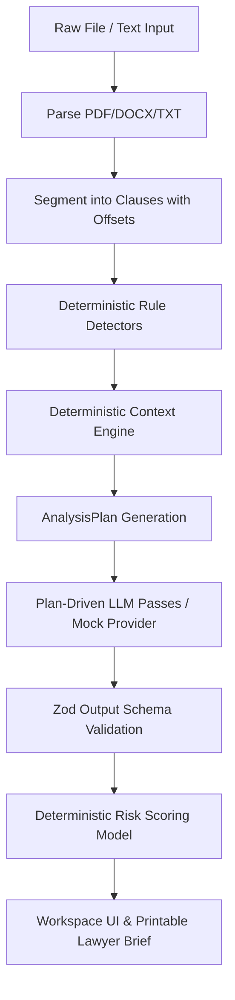

# Aequitas — Equal footing in every agreement.

> Plain-language legal contract analysis, clause risk detection, persona-tuned guidance, and actionable briefs for non-lawyers in India.

---

## 1. What it is

**Aequitas** is a web application designed for everyday individuals with no legal background. When a user pastes or uploads a legal document — such as a Leave & Licence agreement, freelance contract, employment offer letter, consumer privacy policy, or loan sanction letter — Aequitas provides:

- **Plain-language summary** (at an 8th-grade reading level).
- **Clause-by-clause breakdown** with severity and risk scoring tuned strictly to **who the user is** (Persona) and **their jurisdiction**.
- **Interactive document Q&A** with mandatory clickable citation chips `[c-0001]` grounded strictly in document text.
- **Contract comparison** against a second document or a built-in "fair market baseline".
- **Actionable checklist & negotiation asks** with proposed redline wording.
- **One-page printable Lawyer Brief** to take to a legal aid professional.

Aequitas **never gives legal advice** and automatically routes users to free legal aid resources (NALSA, State Legal Services Authorities, Tele-Law, National Consumer Helpline 1915) whenever emergency or high-risk legal scenarios are detected.

---

## 2. Chosen Vertical & Persona Set

**Vertical:** AI for Legal Assistance & Access.  
**Default Jurisdiction:** India (State-selectable: Maharashtra, Delhi, Karnataka, Telangana, West Bengal, and Other).

Aequitas is built for five specific target personas:

| Persona | Description | Typical Documents | Key Risks & Concerns |
|---|---|---|---|
| `tenant` | Home renter | Leave & Licence, rent agreement, NOC | Deposit forfeiture, sudden eviction, hidden charges, lock-in period |
| `freelancer` | Independent contractor | Service agreement, SOW, NDA, MSA | Non-payment, unlimited liability, IP assignment on signature, non-compete |
| `employee` | Salaried worker | Offer letter, employment contract, bond | Long notice period, training bonds/penalties, non-compete, garden leave |
| `consumer` | App user / buyer | Privacy policy, T&C, warranty, insurance | Data sharing, auto-renewal, arbitration waivers, unilateral amendments |
| `borrower` | Credit applicant | Loan sanction letter, personal loan, guarantee | Hidden interest, prepayment/foreclosure fees, guarantor liability |

---

## 3. Approach & Logic — The Context Engine

The core value of Aequitas is its **deterministic Context Engine** ([`src/lib/context/router.ts`](file:///c:/Users/Asus/OneDrive/Desktop/Aequitas/src/lib/context/router.ts)). The engine evaluates user context (Persona × Jurisdiction × Goal × Deadline × Signed status) *before* any LLM call to produce an `AnalysisPlan`.

### Worked Example:
- **User Input:** Tenant in Maharashtra (`MH`), goal: `negotiate`, deadline: 4 days away.
- **Context Engine Logic:**
  1. Detects document as `rental` (Leave & Licence).
  2. Prioritizes `security-deposit`, `lock-in`, `notice-period-asymmetry`, and `rent-escalation`.
  3. Increases risk weights for deposit refund and early exit clauses.
  4. Surfaces Maharashtra Rent Control Act 1999 statute hints (as informational pointers).
  5. Triggers negotiation outputs (redline suggestions, counter-proposals).
  6. Flags urgent deadline (< 7 days) and prioritizes time-sensitive exit terms.

---

## 4. Architecture Diagram



---

## 5. How to Run

### Zero API Key Demo (Mock Mode - Default)

Aequitas is fully functional without any API key using deterministic fixtures:

```bash
# 1. Install dependencies
npm install

# 2. Start dev server (LLM_PROVIDER defaults to mock if no keys set)
LLM_PROVIDER=mock npm run dev
```

Open [http://localhost:3000](http://localhost:3000) in your browser.

### Production / Real LLM Mode

Copy `.env.example` to `.env.local` and configure your keys:

```env
LLM_PROVIDER=gemini
GEMINI_API_KEY=your_gemini_api_key_here
GEMINI_MODEL=gemini-2.0-flash
```

Then run:

```bash
npm run dev
```

---

## 6. How it Decides — Risk Scoring & Escalation

### Risk Scoring Formula
$$\text{Score} = \text{clamp}\left(0, 100, \text{severity} \times 10 \times \text{personaWeight} + \text{asymmetryPenalty} + \text{deadlinePressure} - \text{mutualityCredit}\right)$$

- **0–29:** Standard
- **30–59:** Worth a look
- **60–79:** Negotiate this
- **80–100:** Get legal advice

### Escalation Triage Triggers
If any emergency trigger is detected (e.g. court summons, FIR, eviction notice, PoSH/harassment, self-harm risk), Aequitas immediately displays an **Escalation Banner**, constrains analysis to basic facts, and connects the user directly to legal aid resources (NALSA / Tele-Law / Helpline 1915).

---

## 7. Safety & Scope

- **No Legal Advice:** Aequitas provides informational text analysis only.
- **Statute Pointers:** References to statutes are informational pointers for self-reading, never legal opinions.
- **Always-on Disclaimer:** Rendered on every view and printed brief: *"Aequitas gives information, not legal advice. It can be wrong. For decisions that matter, talk to a lawyer."*

---

## 8. Security & Privacy

- **No Persistence:** Zero database, zero disk storage of document text. Document text exists only in memory for the request duration.
- **PII Redaction:** Aadhaar, PAN, phone numbers, email addresses, and bank accounts are masked before reaching the LLM and rehydrated locally.
- **No Client Keys:** All LLM requests execute in server API routes.

---

## 9. Accessibility (WCAG 2.1 AA)

- Keyboard navigation and visible focus rings across all interactive controls.
- Color contrast >= 4.5:1; risk bands rely on text labels and icons, never color alone.
- Highlighting and screen-reader live region (`aria-live="polite"`) updates.

---

## 10. Testing

Run the test suite:

```bash
# Run unit & schema contract tests
npm run test

# Run TypeScript check
npm run typecheck
```

---

## 11. Assumptions & Limitations

- Scanned PDFs without OCR text layers prompt the user to copy/paste text.
- Legal statute hints are tailored for Indian jurisdiction defaults.

---

## 12. Future Enhancements

- Client-side OCR via WebAssembly for scanned document support.
- Expanded vernacular support (Tamil, Telugu, Kannada).
