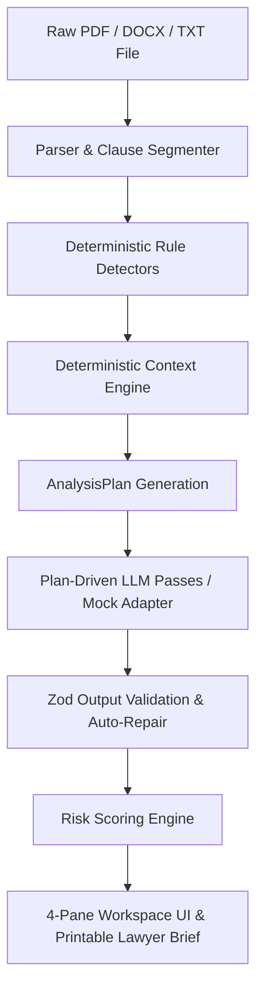

# Aequitas Architecture Specification

This document provides a deep dive into the technical architecture, data processing pipeline, and safety mechanisms of **Aequitas**.

---

## 1. System Overview

Aequitas is an in-process, privacy-first web application built on **Next.js 14 App Router** and **TypeScript**. It evaluates legal contracts without requiring a persistent database or third-party vector store.

---

## 2. Core Components

### 2.1 Context Engine (`src/lib/context/router.ts`)

The Context Engine is a **pure, deterministic rule router** executed *before* any LLM call. It produces an `AnalysisPlan` based on:
- **Persona**: `tenant`, `freelancer`, `employee`, `consumer`, `borrower`.
- **Jurisdiction**: Indian state codes (`MH`, `DL`, `KA`, `TG`, `WB`, `OTHER`).
- **Goal**: `understand`, `decide`, `negotiate`, `dispute`, `prepare-for-lawyer`.
- **Deadline**: Urgent pressure flag ($< 3$ days or $< 7$ days).

#### Example Output Plan:
- Prioritizes deposit, exit, and notice asymmetry terms for tenants in Maharashtra.
- Injects statute hints (e.g., *Maharashtra Rent Control Act 1999*).
- Formulates risk weighting adjustments.

---

### 2.2 Clause Parser & Segmentation (`src/lib/parse/`)

- **PDF Parsing**: Uses `pdfjs-dist` to extract structured text layers and detect scanned PDFs without text layers.
- **DOCX Parsing**: Uses `mammoth` to convert Word documents into clean text.
- **Segmentation** (`segment.ts`): Splits text into numbered clauses (`c-0001`, `c-0002`, etc.) while retaining **exact character start and end offsets**.

---

### 2.3 Deterministic Detectors (`src/lib/analysis/detectors.ts`)

~20 pattern detectors run prior to LLM analysis to flag high-risk clause structures deterministically:
- Security Deposit refund terms & Lock-in periods
- Unilateral termination & Notice asymmetry
- Non-compete and non-solicit duration
- Limitation of liability & Mutual indemnity
- Governing law & Exclusive jurisdiction

---

### 2.4 In-Process BM25 Retrieval (`src/lib/bm25/index.ts`)

For document Q&A (`/api/ask`), Aequitas builds an in-memory **BM25 index** over document clause chunks.
- Computes Term Frequency (TF) and Inverse Document Frequency (IDF).
- Retrieves top-scoring clause chunks relevant to user questions.
- Enforces strict server-side citation chip validation (`[c-0001]`).

---

### 2.5 Security & Privacy Redaction (`src/lib/security/`)

- **PII Redaction**: Regex-based masking for Aadhaar, PAN, phone numbers, emails, and street addresses prior to LLM submission.
- **Prompt Injection Defense**: Sanitizes user queries and enforces strict system preambles ("never legal advice").

---

### 2.6 Emergency Escalation Triage (`src/lib/context/escalation.ts`)

If red-flag keywords are detected (court summons, eviction notices, harassment, PoSH violations, self-harm risk):
1. Immediately triggers `EscalationBanner`.
2. Connects the user directly to legal aid resources:
   - **NALSA Legal Services**: `15100`
   - **Tele-Law**: `14416`
   - **National Consumer Helpline**: `1915`
